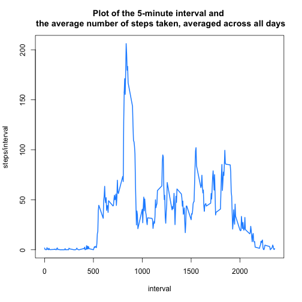
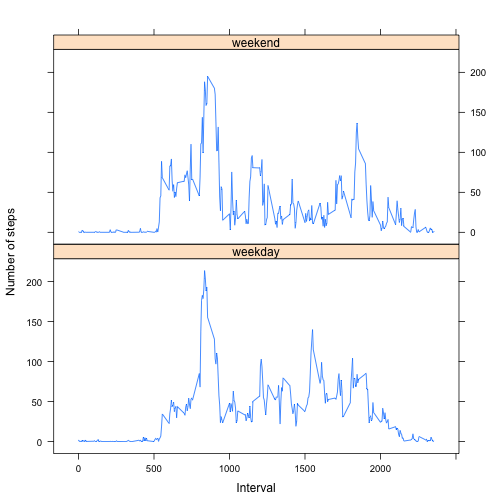

## Loading and preprocessing the data

The data for this report can be found at https://d396qusza40orc.cloudfront.net/repdata%2Fdata%2Factivity.zip.
We can read it by using the following command:  


```r
unzip("activity.zip")
act <- read.csv("activity.csv")
act$date = as.Date(act$date)
```


## What is mean total number of steps taken per day?

**Histogram of the total number of steps taken each day**

```r
stepsEachDay <- aggregate(list(steps=act$steps), by = list(date=act$date), FUN = sum, na.rm = TRUE)
hist(stepsEachDay$steps, breaks=10, main = "Histogram of the total number of steps taken each day",xlab="steps/day", col="dodgerblue")
```

 

**Mean and median total number of steps taken per day**

```r
mean(stepsEachDay$steps)
```

```
## [1] 9354.23
```

```r
median(stepsEachDay$steps)
```

```
## [1] 10395
```

## What is the average daily activity pattern?

**Plot of the 5-minute interval and the average number of steps taken, averaged across all days**

```r
stepsPerInterval <- aggregate(list(steps=act$steps), by = list(interval=act$interval), FUN = mean, na.rm = TRUE)
plot(stepsPerInterval$interval, stepsPerInterval$steps, main = "Plot of the 5-minute interval and \n the average number of steps taken, averaged across all days",xlab="interval", ylab='steps/interval', col="dodgerblue", type='l', lwd=2)
```

 
**Which 5-minute interval, on average across all the days in the dataset, contains the maximum number of steps?**

```r
stepsPerInterval[which.max(stepsPerInterval$steps), ]
```

```
##     interval    steps
## 104      835 206.1698
```


## Imputing missing values

**Total number of missing values in the dataset**  
We observe that only the variable *steps* has 2304 missing values

```r
apply(act, 2, function(x) table(is.na(x)))
```

```
## $steps
## 
## FALSE  TRUE 
## 15264  2304 
## 
## $date
## 
## FALSE 
## 17568 
## 
## $interval
## 
## FALSE 
## 17568
```
**Strategy for filling in all of the missing values in the dataset**  
For any NA values, we fill in with te calculated mean for that interval

```r
library(zoo)
```

```
## 
## Attaching package: 'zoo'
## 
## The following objects are masked from 'package:base':
## 
##     as.Date, as.Date.numeric
```

```r
actFilled <- act
actFilled$steps <- na.aggregate(act$steps, by=act$interval, FUN=mean)
```

**Histogram of the total number of steps taken each day and Calculate and report the mean and median total number of steps taken per day. Do these values differ from the estimates from the first part of the assignment? What is the impact of imputing missing data on the estimates of the total daily number of steps?**  
Here is the histogram ot the total number of steps taken each day after missing values were imputed

```r
stepsEachDay <- aggregate(list(steps=actFilled$steps), by = list(date=actFilled$date), FUN = sum, na.rm = TRUE)
hist(stepsEachDay$steps, breaks=10, main = "Histogram of the total number of steps taken each day",xlab="steps/day", col="dodgerblue")
```

 

```r
mean(stepsEachDay$steps)
```

```
## [1] 10766.19
```

```r
median(stepsEachDay$steps)
```

```
## [1] 10766.19
```
As an effect of filling in the missing values, the mean and the median are both higher. We also observe that the mean and the median are now the same.

## Are there differences in activity patterns between weekdays and weekends?

**Factor variable in the dataset with two levels -- "weekday" and "weekend" indicating whether a given date is a weekday or weekend day.**  

```r
actFilled$dayType = as.factor(weekdays(actFilled$date))
levels(actFilled$dayType) <- c("weekday","weekday","weekend","weekend","weekday","weekday","weekday")
```

**Panel plot containing a time series plot (i.e. type = "l") of the 5-minute interval (x-axis) and the average number of steps taken, averaged across all weekday days or weekend days (y-axis). The plot should look something like the following, which was created using simulated data:**  
The following two figures show the average number of steps taken per interval on weekend and weekdays.  
The graphs are similar from midnight to the morning hours, but show that the weekend afternoons and evenings tend to be more active than they are on weekdays.

```r
library(lattice)
dailyActivity <- aggregate(list(steps = actFilled$steps), by=list(interval = actFilled$interval, dayType = actFilled$dayType), FUN=mean, na.rm=TRUE)
xyplot(steps ~ interval | dayType, data = dailyActivity, type='l', layout = c(1,2), xlab="Interval", ylab="Number of steps")
```

 


